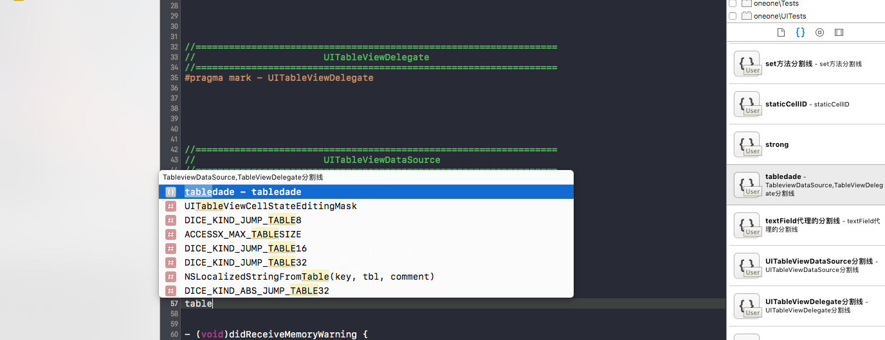
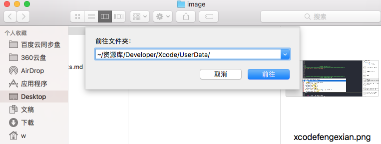
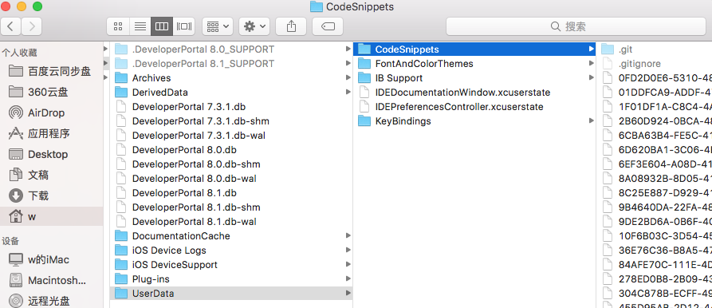
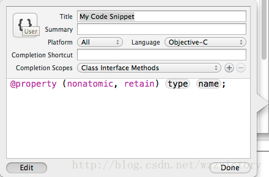

##
Xcode代码片段code snippets

编辑人：victor   日期：2016-11-17

###一.首先看下几个我们常用的代码片段

1.我们使用  #pragma -mark-  一般都会配合注释使用

2.定义属性等等

	用好代码片段可以大大提高我们的开发效率，所以我们可以多定义几个常用的代码片段
	来提高开发效率

###二.自定义的代码片段存放在哪里？

Xcode中的自定义的代码片段一般存放于：

~/Library/Developer/Xcode/UserData/CodeSnippets

	备注：

	我们可以将目录中的代码片段备份，也可以将其直接拷出来放在不同的电脑上使用，
	因此多台电脑之间的协作也毫无压力。

###三.如何自定义代码片段

1.操作步骤：

* 1.用xcode新建一个项目，随便打开一个.h或者.m文件

* 2.随便在一个空白位置，输入  (“<#”、“#>”这两个符号的作用敲完你就明白了)
@property (nonatomic, retain) <#type#> *<#name#>; 

* 3.打开XCode右侧的Utilities View，然后在其靠底部的位置找到并打开Code Snippets Library

* 4.选中我们刚刚输入的那段代码，把它拖到Code Snippets Library中

* 5.滚动到Code Snippets Library的最底部，找到一个花括号上面带个“User”文字的图标

* 6.单击那个图标，会弹出一个窗口。然后点击窗口底部左边的Edit按钮 

* 7.在Title和Completion shortcut这两项中，输入代码片段的标题和快捷键。快捷键用于激活代码提示，标题则会显示在代码提示中

* 8.选择对应的platform、language和Completion scope。然后点击“Done”按钮

2.编辑如下：

 	图中从上到下的含义依次是：
	①Title
	代码片段的标题
	②Summary
	代码片段的描述文字
	③Platform
	可以使用代码片段的平台，有IOS/OS X/All三个选项
	④Language
	可以在哪些语言中使用该代码片段
	⑤Completion Shortcut
	代码片段的快捷方式，比如本文开头用到的dowhile，在这里，把属性设置的快捷方式设	为property
	⑥Completion Scopes
	可以在哪些文件中使用当前代码片段，比如全部位置，头文件中等，当然可以添加多个支	持的位置。
	最后的一个大得空白区域是对代码片段的效果预览。
	一切设置完成以后，点击该菜单右下角的Done按钮，新建工作就结束了。

###四.备份代码片段

	1、其实代码片段定义起来也非常简单，无任何技巧可言。
		唉，无脑的活实在不想做，所以还是需要备份一份。
	2、总有些情况会让你在别的机器上使用Xcode编程。

   	新公司、新电脑等等
    一个人多台机器，公司一台iMac,家里一台Pro
    
   提示两种方式保存：
   
   * 用u盘保存代码
   
   		只需将代码片段复制粘贴到存放代码片段的路径即可，非常简单。

   * 使用git来管理代码片段

    	将本地的代码片段所在的文件夹设置成一个Git版本库，并且关联到Github上。
    	这样你若增加了某个代码片段，就可以很方便地使用Git来备份代码片段，
    	并且别的mac机器上同样很方便地通过Git来更新代码片段。
    	
    	
  git备份地址:
  
  下载后，拖入 ‘  ~/Library/Developer/Xcode/UserData/CodeSnippets  ’  文件夹重启xcode即可：
 
  [https://github.com/wsl-victor/ProjectBaseSet-OC/tree/master/iOS-Skill/CodeSnippets](https://github.com/wsl-victor/ProjectBaseSet-OC/tree/master/iOS-Skill/CodeSnippets)
 
    
